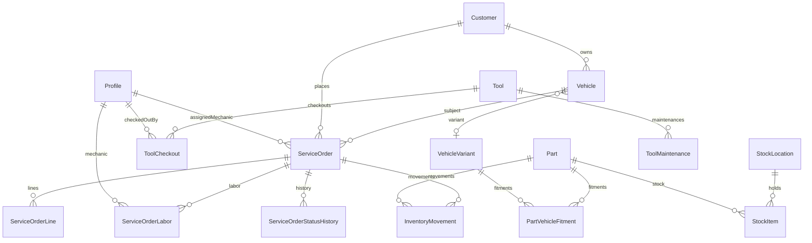

# Oficina — Sistema de Gestão Mecânica

Monorepo TypeScript ([Turborepo](https://turbo.build)) com **Next.js 15** (interface + API REST), **PostgreSQL** no **Supabase** via **Prisma**, autenticação **Supabase Auth** e **RBAC** (Admin, Gerente, Mecânico).

Este documento descreve **fluxo de dados**, **pastas**, **papéis** e como as peças se conectam.

---

## Visão geral do domínio

O sistema cobre o ciclo de uma oficina:

1. **Cadastros** — clientes, veículos (placa, modelo, ano, cor, problema relatado), variantes de veículo para *fitment* de peças.
2. **Estoque** — peças, locais, quantidades, movimentos (entrada/saída/ajuste/consumo por OS).
3. **Ordens de serviço (OS)** — máquina de estados, linhas (peça/serviço), mão de obra, vínculo com cliente/veículo e mecânico.
4. **Ferramentas** — patrimônio, retirada/devolução, manutenção.
5. **Usuários** — perfil espelhado em `profiles` com papel (`UserRole`).

---

## Estrutura do monorepo

| Pasta | Pacote | Função |
|-------|--------|--------|
| `apps/web` | `@oficina/web` | Next.js App Router, páginas, componentes client/server, **Route Handlers** em `app/api/v1/*`, `middleware.ts`. |
| `packages/database` | `@oficina/database` | `schema.prisma`, migrações, `seed.ts`, export do **Prisma Client** (`src/index.ts`). |
| `packages/shared` | `@oficina/shared` | Schemas **Zod**, helpers de resposta HTTP (`apiSuccess` / `apiError`), tipos compartilhados. |
| `packages/auth` | `@oficina/auth` | `withAuth`, `resolveAuth`, mapa de rotas → papéis (`ROUTE_ROLE_MAP`), utilitários de papel. |

Comandos raiz (`package.json`): `pnpm dev` (turbo), `pnpm build`, `pnpm db:generate`, `pnpm db:migrate`, `pnpm db:seed`, etc.

O **cliente Prisma** é gerado a partir de `packages/database` e consumido pelo app e pela camada de repositórios.

---

## Árvore conceitual (o que importa no dia a dia)

```
Oficina/
├── apps/web/
│   ├── app/                          # App Router
│   │   ├── (auth)/login/             # Login Supabase (sessão em cookie)
│   │   ├── admin/                    # Área ADMIN (ex.: usuários)
│   │   ├── manager/                  # Gestão: clientes, peças, …
│   │   ├── workshop/                 # Oficina: OS, ferramentas, dashboard
│   │   ├── api/v1/                   # REST: um route.ts por recurso (ou segment)
│   │   ├── layout.tsx, page.tsx, globals.css
│   │   └── unauthorized/page.tsx
│   ├── components/                   # UI: actions (botões + modais), layout, ui (primitivos)
│   ├── lib/                          # api-client (Bearer), supabase (client/server/middleware), utils
│   ├── middleware.ts                 # Sessão + RBAC por prefixo de URL
│   └── server/
│       ├── lib/parse.ts              # parseJson / query Zod nas rotas API
│       └── modules/                  # *repository.ts — único acesso Prisma por domínio
│           ├── customers/
│           ├── vehicles/
│           ├── service-orders/
│           ├── inventory/
│           ├── tools/
│           └── users/
├── packages/database/prisma/
│   ├── schema.prisma
│   ├── migrations/
│   └── seed.ts
├── packages/shared/src/
│   ├── schemas/                      # customer, vehicle, part, tool, service-order, user
│   └── api.ts
└── packages/auth/src/
    ├── with-auth.ts                  # API: valida Bearer + Profile no Prisma
    ├── roles.ts                      # prefixos /admin, /manager, /workshop
    └── types.ts
```

Arquivos de ambiente: `.env.example` na raiz (variáveis usadas por Prisma e Next); o app carrega ENV da raiz conforme `next.config.ts`.

---

## Fluxo de dados (ponta a ponta)

### 1. Navegador → páginas (Server Components)

1. O pedido passa por **`middleware.ts`**: renova sessão Supabase (`updateSession`), exige login nas rotas protegidas e, para `/admin`, `/manager` e `/workshop`, consulta a tabela **`profiles`** via **service role** para checar `role` e `active`.
2. **Layouts** (`admin/layout.tsx`, `manager/layout.tsx`, `workshop/layout.tsx`) costumam usar **`DashboardShell`**, que garante `Profile` no Prisma (cria MECHANIC padrão se faltar).
3. **Páginas** (ex.: `manager/customers/page.tsx`) importam **`prisma`** de `@oficina/database` e leem dados diretamente no servidor (sem passar pela REST), ou redirecionam se não autenticado.

### 2. Navegador → API JSON (`/api/v1/*`)

1. Componentes **client** (`"use client"`) usam **`apiFetch`** (`lib/api-client.ts`): obtém **sessão Supabase** no browser e envia `Authorization: Bearer <access_token>`.
2. O **Route Handler** importa **`withAuth`** de `@oficina/auth`: **`resolveAuth`** valida o JWT com Supabase Admin, carrega **`Profile`** no Prisma (criação “lazy” igual ao shell, se necessário), e opcionalmente restringe **`roles`**.
3. Entrada é validada com schemas **`@oficina/shared`** via **`parseJson`** / **`parseSearchParams`** (`server/lib/parse.ts`).
4. O handler chama um **`repository`** em `server/modules/*` que executa **`prisma.*`**.
5. Resposta: **`Response.json(...)`** — corpo direto do recurso (sem wrapper `{ data }`), erros `{ error, code? }`.

Assim, há **dois caminhos de leitura**: Server Component → Prisma; Client → REST → withAuth → Repository → Prisma. Escrita a partir do browser passa quase sempre pela **API v1** + Zod.

### 3. Banco de dados

- **Prisma** usa `DATABASE_URL` e `DIRECT_URL` (Postgres Supabase).
- Migrações versionadas em `packages/database/prisma/migrations/`.
- **Seed**: `pnpm db:seed` popula dados de desenvolvimento.

---

## Modelo de dados (relacionamentos principais)



Resumo:

- **`Profile`** — usuário do Auth; papel RBAC.
- **`Customer`** → **`Vehicle`** (placa única; `vehicleModel`, `vehicleYear`, `reportedIssue`; `variant` opcional para catálogo/fitment).
- **`Part`** + **`PartVehicleFitment`** + **`VehicleVariant`** — quais peças “servem” para qual variante.
- **`StockItem`** — peça por local; **`InventoryMovement`** — auditoria e operações.
- **`ServiceOrder`** — cliente, veículo, mecânico opcional, totais, status (`DRAFT` → … → `CANCELLED`).
- **`ServiceOrderLine`** / **`ServiceOrderLabor`** — itens cobrados.
- **`Tool`** / **`ToolCheckout`** / **`ToolMaintenance`** — controle de ferramentas.

Enums importantes: `UserRole`, `ServiceOrderStatus`, `InventoryMovementType`, `ToolStatus`, etc. (ver `schema.prisma`).

---

## Autenticação e autorização

| Camada | O que faz |
|--------|-----------|
| **Middleware** | Cookies de sessão; bloqueia anônimos; para rotas `/admin`, `/manager`, `/workshop`, exige `profiles.role` compatível com `ROUTE_ROLE_MAP` em `packages/auth/src/roles.ts`. |
| **withAuth (API)** | Bearer token; perfil ativo; `roles` por endpoint. |
| **Regras de negócio** | Ex.: `requireMechanicOwnsOrder` — mecânico só altera OS atribuída a ele (exceto admin/gerente). |

Rotas públicas no middleware incluem `/login`, `GET /api/v1/health` e o cron de estoque (com segredo próprio).

---

## Áreas da interface (App Router)

| Prefixo | Público alvo | Observação |
|---------|----------------|------------|
| `/admin/*` | ADMIN | Usuários / configurações administrativas. |
| `/manager/*` | ADMIN, MANAGER, MECHANIC | Clientes, veículos, peças, estoque (conforme telas implementadas). |
| `/workshop/*` | ADMIN, MANAGER, MECHANIC | OS, ferramentas, visão operacional. |
| `/login` | todos | Entrada Supabase. |

Fluxo **Novo cliente**: botão em `components/actions/add-customer-button.tsx` — salva cliente via `POST /api/v1/customers` e em seguida exibe o mesmo bloco de **veículo** usado em `vehicle-create-form-fields.tsx` (ou **Pular**).

---

## API REST (v1)

Autenticação: header **`Authorization: Bearer <access_token>`** (Supabase).

| Módulo | Endpoints (principais) |
|--------|-------------------------|
| Sistema | `GET /api/v1/health` |
| Sessão | `GET /api/v1/me` |
| Usuários | `GET/PATCH /api/v1/users`, `GET/PATCH /api/v1/users/[id]` (ADMIN) |
| Clientes | `GET/POST /api/v1/customers`, `GET/PATCH/DELETE /api/v1/customers/[id]` |
| Veículos | `GET/POST /api/v1/vehicles` |
| Variantes | `GET/POST /api/v1/vehicle-variants` |
| Peças | `GET/POST /api/v1/parts`, `PATCH /api/v1/parts/[id]` |
| Estoque | `GET /api/v1/inventory/locations`, `POST /api/v1/inventory/movements` |
| Ferramentas | `GET/POST /api/v1/tools`, checkout, return, maintenance |
| OS | `GET/POST /api/v1/service-orders`, `GET/PATCH /api/v1/service-orders/[id]`, `POST …/transition`, `…/lines`, `…/labor` |
| Dashboard | `GET /api/v1/dashboard/stats` |
| Cron | `GET/POST /api/v1/cron/low-stock` (protegido por `CRON_SECRET`) |

Cada rota valida entrada com Zod em `@oficina/shared` e devolve JSON consistente com `api.ts`.

---

## Pré-requisitos

- Node.js 20+
- pnpm 9+
- Projeto [Supabase](https://supabase.com) com Postgres (Auth habilitado)

---

## Configuração e comandos

1. Copie **`.env.example`** para **`.env`** na raiz (e alinhe `apps/web` se usar arquivo separado). **Nunca** commite chaves reais — o example usa só placeholders.
2. Preencha `DATABASE_URL` e `DIRECT_URL` com as URLs do **pooler** no Supabase Dashboard. O host `db.<ref>.supabase.co:5432` costuma ser só IPv6 e falha em muitas redes Windows com *Can't reach database server*.
3. Configure `NEXT_PUBLIC_SUPABASE_*`, `SUPABASE_SERVICE_ROLE_KEY` e `CRON_SECRET` (o Next carrega o `.env` da **raiz** do monorepo).
4. (SaaS) Preencha as variáveis `STRIPE_*` e `NEXT_PUBLIC_APP_URL` conforme o `.env.example`. Checklist da fundação: [`ops/fase-0-acoes-manuais.md`](ops/fase-0-acoes-manuais.md).

```bash
pnpm install
pnpm db:generate
pnpm --filter @oficina/database db:migrate       # desenvolvimento (cria migrações interativas)
pnpm --filter @oficina/database db:migrate:deploy  # CI/produção (aplica migrações existentes)
pnpm db:seed
pnpm dev
```

---

## Deploy (Vercel)

- **Root directory**: `apps/web`
- **Install / Build**: definidos em [`apps/web/vercel.json`](apps/web/vercel.json) (`pnpm install` + `db:generate` + build do `@oficina/web` a partir da raiz do monorepo).
- **Variáveis**: todas as do `.env.example` (Supabase, Prisma, `CRON_SECRET`, Stripe, `NEXT_PUBLIC_APP_URL`).
- **Cron**: `0 8 * * *` → `/api/v1/cron/low-stock` (requer `CRON_SECRET`).
- Páginas públicas legais: `/termos`, `/privacidade`.
- Métricas manuais (MRR / trial): [`ops/metrics.csv`](ops/metrics.csv).

---

## Papéis (RBAC)

- **ADMIN** — usuários e acesso irrestrito às operações.
- **MANAGER** — gestão completa operacional (cadastros, OS, estoque, ferramentas conforme política da API).
- **MECHANIC** — operação em oficina; cadastros em `/manager/*`; restrições em OS (ex.: só a OS atribuída a ele onde aplicável).

---

## Seed

Perfis de exemplo no seed (emails fictícios; vincule usuários reais no Supabase Auth se quiser logar):

- `admin@oficina.local` (ADMIN)
- `gerente@oficina.local` (MANAGER)
- `mecanico@oficina.local` (MECHANIC)

---

## Onde alterar o quê (referência rápida)

| Mudança | Onde olhar |
|---------|------------|
| Campos no banco / relações | `packages/database/prisma/schema.prisma` + migração |
| Validação de API / tipos de formulário | `packages/shared/src/schemas/*` |
| Nova rota HTTP | `apps/web/app/api/v1/.../route.ts` + repository |
| Quem pode acessar a API | `withAuth(..., { roles })` na rota |
| Quem acessa uma URL de página | `packages/auth/src/roles.ts` + `middleware.ts` |
| Botões/modais de cadastro | `apps/web/components/actions/*` |

---

Documentação inline adicional: comentários no `schema.prisma` e assinaturas nos repositórios sob `apps/web/server/modules/`.
