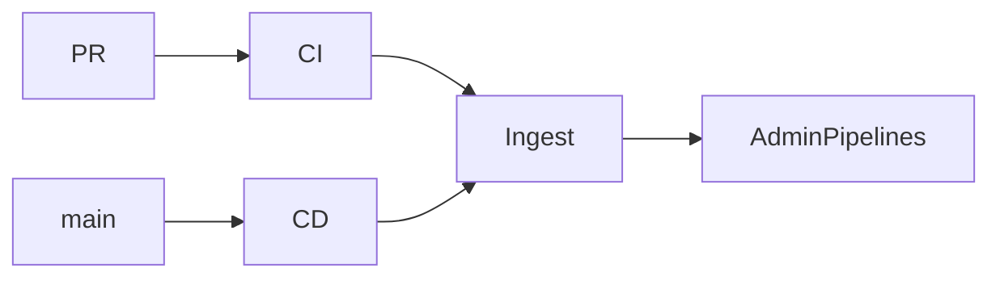

# Pipeline de produção (apps/web)

CI verifica PRs; CD em `main` migra o banco, faz deploy na Vercel e roda smoke da API. Os passos são enviados para o console em **Pipelines**.



## Workflows

| Arquivo | Trigger | O que faz |
|---------|---------|-----------|
| [`.github/workflows/ci.yml`](../.github/workflows/ci.yml) | PR / push `main` | lint, typecheck, unit tests |
| [`.github/workflows/cd-web.yml`](../.github/workflows/cd-web.yml) | push `main` | migrate → Vercel prod → smoke |

Smoke local/remoto:

```bash
pnpm smoke https://seu-app.vercel.app
# ou
node scripts/api-smoke.mjs https://seu-app.vercel.app
```

## Secrets — GitHub Actions

Repository → Settings → Secrets and variables → Actions:

| Secret | Uso |
|--------|-----|
| `DATABASE_URL` | Pooler Postgres (migrate + app) |
| `DIRECT_URL` | Conexão direta (Prisma migrate) |
| `VERCEL_TOKEN` | Token Vercel (Account → Tokens) |
| `VERCEL_ORG_ID` | `.vercel/project.json` após `vercel link` |
| `VERCEL_PROJECT_ID` | idem (projeto do **web**) |
| `PIPELINE_API_BASE` | URL pública do web (ex. `https://app.vercel.app`) — para reportar logs |
| `PIPELINE_INGEST_SECRET` | Bearer da API de pipeline (pode ser o mesmo valor de `CRON_SECRET`) |
| `CRON_SECRET` | Fallback do ingest + crons Vercel |

Sem `PIPELINE_API_BASE`, CI/CD ainda rodam; só não gravam no painel.

## Env — Vercel (apps/web)

Obrigatório (build + runtime):

- `NEXT_PUBLIC_SUPABASE_URL`
- `NEXT_PUBLIC_SUPABASE_ANON_KEY`
- `SUPABASE_SERVICE_ROLE_KEY`
- `DATABASE_URL` / `DIRECT_URL`
- `NEXT_PUBLIC_APP_URL` (= URL do deploy, sem `/` final)
- `CRON_SECRET`

Recomendado: Mercado Pago (`MERCADOPAGO_*`), `PLATFORM_ADMIN_EMAILS`, `PIPELINE_INGEST_SECRET`.

`NEXT_PUBLIC_*` exigem **redeploy** após alteração.

## Console admin

- **Pipelines** (`/pipelines`) — lista de runs
- Detalhe — timeline dos steps + link GitHub Actions
- **Saúde / Overview** — card do último CD; alerta se falhou

## API de ingest

Autenticada com `Authorization: Bearer $PIPELINE_INGEST_SECRET` (ou `CRON_SECRET`):

- `POST /api/v1/platform/pipeline/runs`
- `POST /api/v1/platform/pipeline/runs/:id/steps`

Helper: [`scripts/pipeline-report.sh`](../scripts/pipeline-report.sh)

## Health

`GET /api/v1/health` → **200** + `status: ok` se DB ok; **503** se DB down.

## Retenção

Cron semanal `GET /api/v1/cron/pipeline-prune` (Vercel, domingo 03:00 UTC) apaga runs com mais de 90 dias.

## Setup inicial (checklist)

1. Migrar prod: `pnpm --filter @oficina/database db:migrate:deploy`
2. Colar envs na Vercel + redeploy
3. `vercel link` no `apps/web` → copiar org/project ids para GitHub secrets
4. Criar `VERCEL_TOKEN` + secrets da tabela acima
5. Confirmar Supabase Auth redirect = URL do app
6. Abrir um PR → CI deve ficar verde
7. Merge em `main` → CD + run em `/pipelines`

## Troubleshooting

| Sintoma | Causa comum |
|---------|-------------|
| CI verde, painel vazio | Falta `PIPELINE_API_BASE` / secret no GitHub |
| CD falha no migrate | `DATABASE_URL`/`DIRECT_URL` errados ou migrate não aplicada |
| Smoke 503 | App no ar mas DB inacessível |
| Deploy Vercel “project not found” | `VERCEL_ORG_ID` / `VERCEL_PROJECT_ID` do projeto errado |
| Login quebra após deploy | `NEXT_PUBLIC_SUPABASE_*` não no build / redirect URLs |
